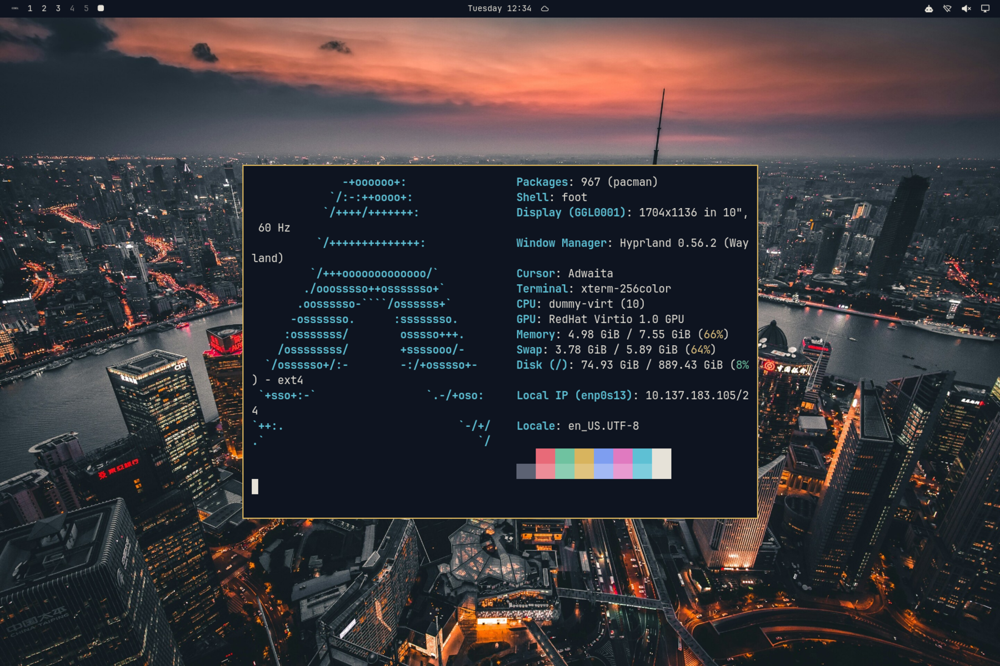

# 上海·夜 Shanghai Night

黄浦江夜色为底、外滩金为印、霓虹粉紫点缀的深色主题。壁纸：陆家嘴、外滩、豫园夜景。



## 安装

```bash
omarchy theme install https://github.com/rwanglq-ctrl/omarchy-shanghai-night-theme
```

## 壁纸来源

1. [陆家嘴与黄浦江暮色俯瞰](https://unsplash.com/photos/shanghai-skyline-and-huangpu-river-D8iZPlX-2fs) — Denys Nevozhai，Unsplash License（Unsplash）
2. [浦东夜色倒影](https://unsplash.com/photos/architectural-photograph-of-lighted-city-sky-5h_dMuX_7RE) — Li Yang，Unsplash License（Unsplash）
3. [The Bund, Shanghai at night.jpg](https://commons.wikimedia.org/wiki/File:The_Bund%2C_Shanghai_at_night.jpg) — Lloyd Tudor，CC BY-SA 4.0（Wikimedia Commons）；已裁切、缩放
4. [豫园湖心亭夜景](https://unsplash.com/photos/a-boat-floating-on-top-of-a-body-of-water-nwIhQUSmFfQ) — Julieta Julieta，Unsplash License（Unsplash）
5. [Shanghai Bund at night 20260417 (4).jpg](https://commons.wikimedia.org/wiki/File:Shanghai_Bund_at_night_20260417_%284%29.jpg) — DvTor8303，CC0（Wikimedia Commons）；已裁切、缩放
6. [豫园夜景](https://unsplash.com/photos/ornate-traditional-chinese-building-illuminated-at-night-TNs2jKkvc3Q) — Rich Xu，Unsplash License（Unsplash）

## 许可

- 壁纸：Wikimedia Commons 照片按各自 CC 许可署名，改编版以 CC BY-SA 4.0 提供；Unsplash 照片依 Unsplash License 使用
- 配色与配置文件：MIT

详见 [LICENSE](LICENSE)。
